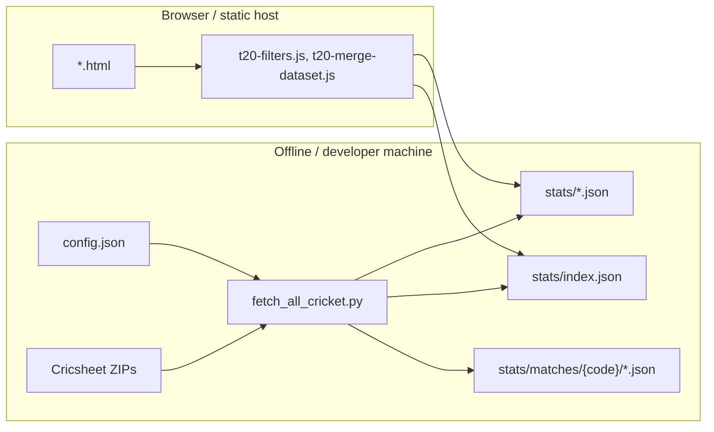
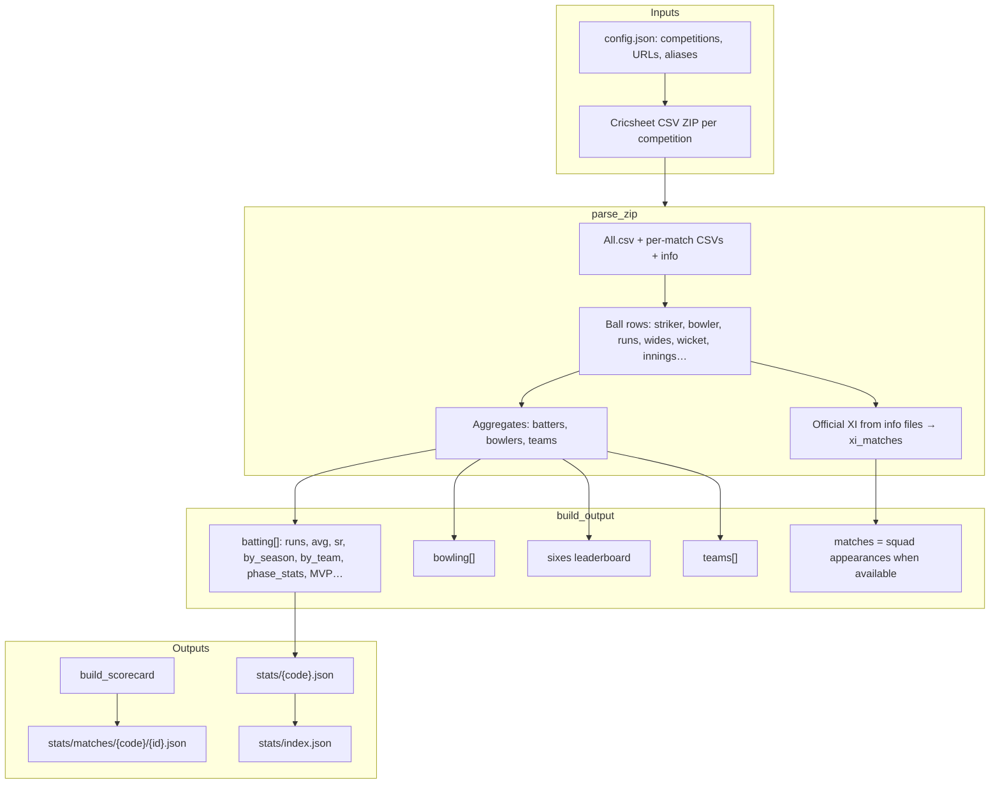
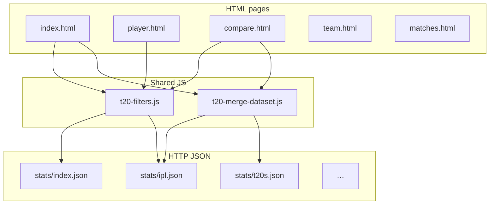

# Cricket-stats — architecture

This document describes how the **cricket-stats** project is structured: offline data pipeline, static JSON, shared browser scripts, and HTML pages.

---

## 1. What this project is

**Cricket-stats** is a **static web app** plus a **Python data pipeline**. There is no application server in the browser path: HTML, JS, and CSS are served as static files, and the UI loads **pre-built JSON** from `stats/`. Heavy computation is **offline**: `fetch_all_cricket.py` downloads Cricsheet zips, parses CSVs, aggregates, and writes JSON.



---

## 2. Repository layout

| Area | Role |
|------|------|
| **`config.json`** | Site defaults (which leagues appear first), Cricsheet download URLs/patterns, competition list, `teamAliases` for normalizing franchise names. |
| **`fetch_all_cricket.py`** | ETL: download → parse ZIP → aggregate → write `stats/{code}.json`, per-match scorecards, `stats/index.json`. |
| **`stats/`** | Generated data: `index.json`, `{ipl,t20s,...}.json`, optional `player_photos.json`, `matches/{code}/` scorecards. |
| **`t20-filters.js`** | Shared URL params, season/year filtering, team filter helpers, franchise rollups used by charts. |
| **`t20-merge-dataset.js`** | Merge multiple competition JSON blobs for dashboard/compare when several leagues are selected. |
| **`index.html`** | Main leaderboard: tables, filters, Chart.js widgets; loads many `stats/{code}.json` and merges. |
| **`player.html`** | Player profile: hero, career tables, charts, matchups tab, photo resolution (Wikipedia/Wikidata/overrides). |
| **`compare.html`** | Two-player compare: merged stats, head-to-head table, runs and franchise charts. |
| **`team.html`**, **`matches.html`** | Team-centric and match-centric views (scorecards, charts). |
| **`.github/workflows/`** | CI: stats refresh, deploy/smoke tests. |
| **`tests/e2e/`** | Playwright-style checks for the deployed site. |

---

## 3. Data pipeline (Python)



**Notable behaviors in the fetcher**

- **`norm_team`** applies **`teamAliases`** so renamed franchises (e.g. Delhi Daredevils → Delhi Capitals) map to one key in aggregates and scorecards.
- **`_official_matches`** prefers **Cricsheet playing XI** from match info when present, so **Mat** reflects squad listing where possible, with a fallback to ball-derived match sets.
- **Batting / bowling `innings`** use distinct **`(match_id, innings)`** keys; wides are excluded from “innings batted” / “innings bowled” so counts stay meaningful.
- **`build_scorecard`** produces **`stats/matches/{code}/{match_id}.json`** for the match browser.

---

## 4. Frontend architecture

Pages are **plain HTML + inline scripts** sharing the same filter/merge vocabulary. There is no bundler: Chart.js loads from a CDN; shared logic lives in **`t20-filters.js`** and **`t20-merge-dataset.js`**.



**Typical flow on `index.html`**

1. Load **`config.json`** (focus leagues, defaults).
2. Load **`stats/index.json`** → competition list and metadata.
3. User picks tournaments / season / year → **`t20ReadFilterParams` / `t20WriteFilterParams`** keep URL and UI aligned.
4. For each selected code, **`fetch('stats/' + code + '.json')`** (often with cache control so merges pick up new JSON).
5. Optionally **`t20FilterBySeason`** clones and trims rows by season or calendar year.
6. **`t20MergeDatasets`** combines leagues for tables and KPIs.
7. **Chart.js** renders charts from merged rows.

**`player.html`** is similar but keyed by **`?name=...`** plus the same filter query string; it loads competition JSON and selects rows by player name. Photos use **`stats/player_photos.json`** overrides first, then Wikipedia / Wikidata, with browser caching keyed by player name.

---

## 5. Data shape (conceptual)

Each **`stats/{code}.json`** is roughly:

```text
{
  competition, code, format, type,
  total_matches, seasons[], last_updated,
  batting: [ { name, matches, innings, runs, balls, avg, sr, mvp_pts, mvp_per_innings,
               by_season: { season: {...} },
               by_team: { "Team Name": { by_season: {...} } },
               phase_stats, vs_type, ... } ],
  bowling: [ ... ],
  sixes: [ ... ],
  teams: [ ... ]
}
```

The **UI does not recompute** full careers from raw balls for dashboards; it **reads** this JSON (and per-match files for **`matches.html`**).

---

## 6. Layer diagram (ASCII)

```text
┌─────────────────────────────────────────────────────────┐
│  Pages: index | player | compare | team | matches       │
├─────────────────────────────────────────────────────────┤
│  Chart.js (CDN) + page-specific inline JS               │
├─────────────────────────────────────────────────────────┤
│  t20-merge-dataset.js  ←→  t20-filters.js               │
│       (merge comps)          (URL, season, team, etc.)  │
├─────────────────────────────────────────────────────────┤
│  Static JSON: stats/index.json, stats/*.json, matches/  │
├─────────────────────────────────────────────────────────┤
│  fetch_all_cricket.py  ←  config.json  ←  cricsheet.org │
└─────────────────────────────────────────────────────────┘
```

---

## 7. CI / operations (high level)

- **`update-stats.yml`** (if enabled): runs **`python fetch_all_cricket.py`** and updates **`stats/`**.
- **`deploy-tests.yml`**: validates the site; may check **`stats/index.json`** and run **Playwright** tests under **`tests/e2e/`**.

Exact behavior depends on the workflow files in **`.github/workflows/`**.

---

## 8. Extending the project

| Goal | Where to change |
|------|------------------|
| New league | **`config.json`** `cricsheet.competitions` → run **`python fetch_all_cricket.py`** |
| Wrong franchise name | **`teamAliases`** in **`config.json`** |
| Wrong player photo | **`stats/player_photos.json`** or photo logic in **`player.html`** |
| New dashboard column | **`fetch_all_cricket.py`** `build_output` + **`index.html`** + **`t20-merge-dataset.js`** if the field must survive merge |

---

## 9. Viewing Mermaid diagrams

GitHub renders **Mermaid** inside fenced blocks tagged `mermaid` when you view this file on github.com. Locally, use a Mermaid-capable preview (VS Code extension, Obsidian, etc.) or paste diagrams into [mermaid.live](https://mermaid.live).

---

## 10. Regenerating data

From the repository root:

```bash
python fetch_all_cricket.py
```

Use **`python fetch_all_cricket.py --comp ipl`** (or other codes from `config.json`) to fetch specific competitions only.
